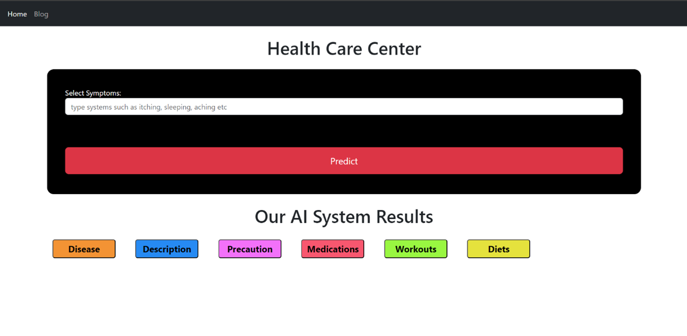
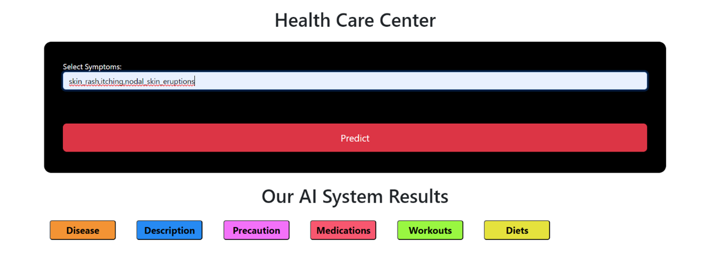

# Healthcare Recommendation System

This project implements a comprehensive **Healthcare Recommendation System** that leverages **machine learning** and **big data tools** to provide symptom-based disease prediction and personalized health advice. 

## Table of Contents
- [Overview](#overview)
- [Features](#features)
- [Technologies Used](#technologies-used)
- [Project Structure](#project-structure)
- [How to Run](#how-to-run)
- [Results](#results)
- [Contributors](#contributors)

## Overview
The Healthcare Recommendation System is designed to assist users in identifying potential diseases based on symptoms and providing personalized recommendations for medications, diets, workouts, and precautions. 

It integrates a Flask-based web application with a Spark-powered backend for real-time predictions and efficient data processing. 

## Features
- **Symptom-based Disease Prediction**: Predict diseases using a pre-trained Random Forest Classifier.
- **Personalized Recommendations**:
  - Descriptions of the predicted disease.
  - Suggested medications, diets, workouts, and precautions.
- **Interactive Web Interface**: User-friendly interface powered by Flask.
- **Scalable Backend**: Utilizes Apache Spark for processing large datasets efficiently.

## Technologies Used
- **Frontend**:
  - HTML with Jinja2 templating (via Flask).
- **Backend**:
  - Flask for web services.
  - Apache Spark for machine learning and data processing.
  - Python libraries: NumPy, Pandas, Pickle.
- **Machine Learning**:
  - Random Forest Classifier for disease prediction.
  - PySpark's MLlib for building and evaluating the model.
- **Datasets**:
  - Symptom-disease relationships.
  - Disease-specific medications, diets, precautions, and workouts.

## Project Structure
```
project-directory/
|-- datasets/
|   |-- symptoms_df.csv
|   |-- precautions_df.csv
|   |-- medications.csv
|   |-- diets.csv
|   |-- description.csv
|   `-- workout_df.csv
|-- models/
|   `-- svc.pkl
|-- app.py         # Flask application
|-- model.py       # Model training script
|-- templates/
|   |-- index.html
|   |-- about.html
|   |-- contact.html
|   `-- developer.html
|-- static/        # Static assets (CSS, JS, images)
`-- README.md
```

## How to Run
### Prerequisites
- Python 3.8+
- Apache Spark
- Flask
- Required Python libraries:
  ```bash
  pip install flask pyspark pandas numpy
  ```

### Steps
1. Clone this repository:
   ```bash
   git clone https://github.com/anna123venkat/Healthcare-Recommendation-System.git
   cd Healthcare-Recommendation-System
   ```
2. Prepare the datasets:
   - Place the CSV files in the `datasets/` directory.
3. Train the model (if needed):
   ```bash
   python model.py
   ```
4. Start the Flask server:
   ```bash
   python app.py
   ```
5. Open the application in your browser:
   ```
   http://localhost:5000
   ```

## Results
### Sample Output
- **Home Page**
  
- **Symptom Input**:
  
- **Predicted Disease with Recommendations**:
  

## Contributors
- **[Abhishek S](https://github.com/Abishek9342)**
- **[Manoj S](https://github.com/Jonam-2004)**
- **[Prasanna Venkatesh S](https://github.com/anna123venkat)**
